# WEB STACK IMPLEMENTATION (LEMP STACK) IN AWS

## Introduction
The LEMP stack is a powerful, open-source collection of software used to develop and host high-performance web applications. Following my previous deployment of the classic LAMP stack, this project focuses on implementing its modern, high-concurrency counterpart. 
The stack consists of four core layers working seamlessly together:

* Linux (Ubuntu): The rock-solid open-source operating system serving as our base. 

* Nginx (Engine-X): The high-performance web server known for its speed, stability, and low resource consumption—replacing Apache in this architecture. 

* MySQL: The robust relational database management system handling data persistence. 

* PHP: The dynamic server-side scripting language processing the application logic. 

This documentation breaks down the step-by-step installation, security configuration, and verification required to build a fully functional LEMP environment from scratch.

## Step 0: Prerequisites
1\. An Ubuntu 26.04 LTS (HVM) operating system was spun up on a t3.micro EC2 instance. This virtual machine was deployed via the AWS console within the us-east-1d region.

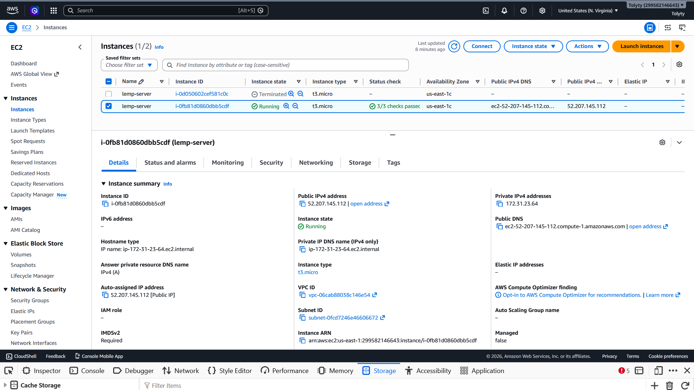

2\. Created SSH key pair named my-ec2-key to access the instance on port 22

3\. Inbound firewall policies were defined within the AWS Security Group using the following rules:

* Allow traffic on port 22 (SSH) with source from any IP address. This is opened by default.
* Allow traffic on port 80 (HTTP) with source from anywhere on the internet. 
* Allow traffic on port 443 (HTTPS) with source from anywhere on the internet. 

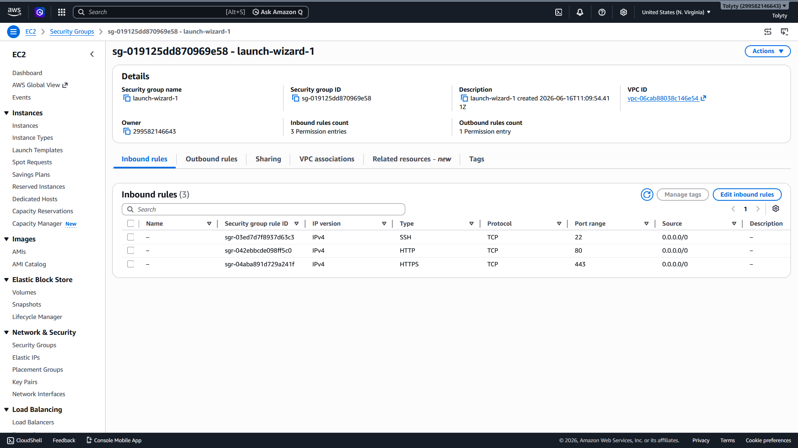

4\. The default VPC and Subnet was used for the networking configuration.

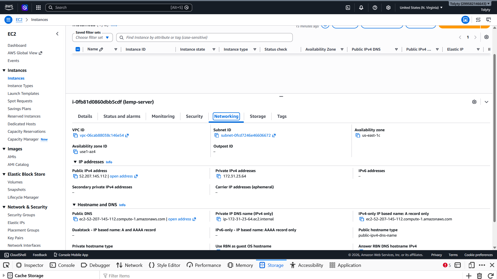

5\. The private ssh key that got downloaded was located, permission was changed for the private key file and then used to connect to the instance by running

```
chmod 400 my-ec2-key.pem
```
```
ssh -i ~/new-lemp-key.pem ubuntu@ec2-52-207-145-112.compute-1.amazonaws.com
```
Where username=ubuntu and public ip address=52-207-145-112

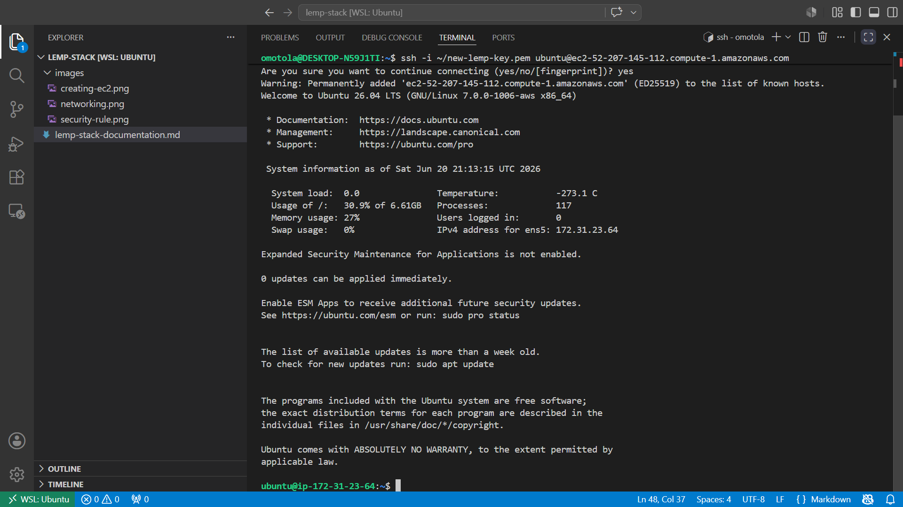

## Step 1: Installing the Nginx Web Server

1\. Update Package Index:

Update the local repository listings to ensure you fetch the latest package versions.

```
sudo apt update && sudo apt upgrade
```

2\. Install the Nginx web server:

```
sudo apt install nginx -y
```

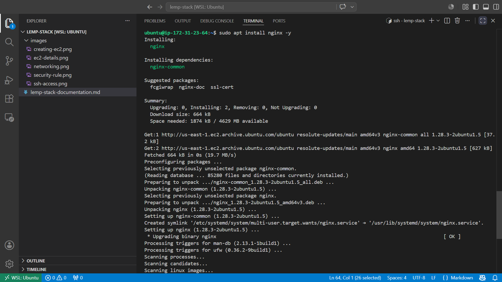

3\. Verify Nginx Status

Check if the Nginx service was successfully installed and is actively running on your system.
Bash

sudo systemctl status nginx

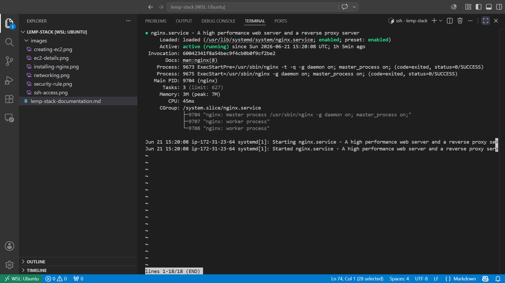


4\. Configure Firewall/Security Group Rules

To allow web traffic to reach your server, you need to open the HTTP port.

Action Required: Add an inbound rule to your AWS EC2 security group configuration to open TCP port 80 (HTTP).

(Note: Port 22 is typically open by default for your SSH connection, but port 80 must be manually added to allow public web browsing access).

5\. To access Nginx locally on Ubuntu shell, run: 

```
curl http//:localhost:80 
```

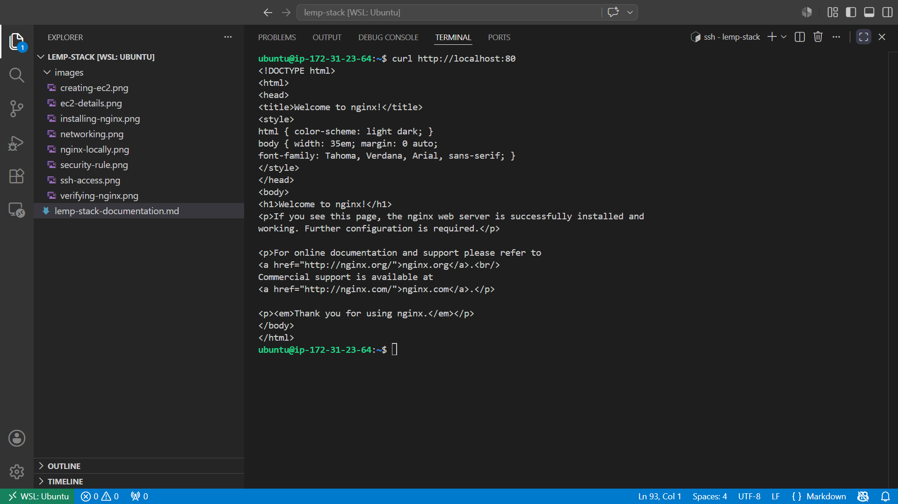

To access it on the web browser with the server's public ip address:

```
http://<public-ip-server>:80  
```

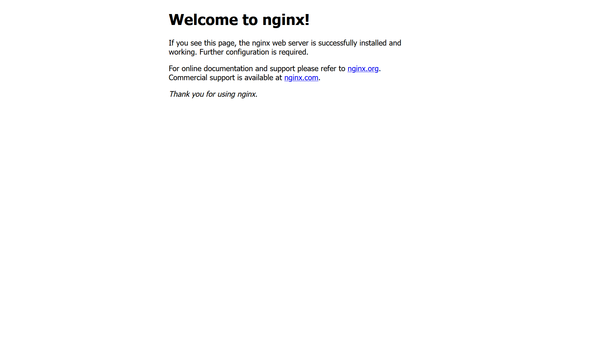

To retrieve your public ip address instead of checking AWS console

```
curl -s http://169.254.169.254/latest/meta-data/public-ipv4
```

## Step 2: Installing MYSQL 
We need a database management system for our webserver and MYSQL is a popular relational database used in php environment.
To install MSQL, run:

```
sudo apt install mysql-server
```

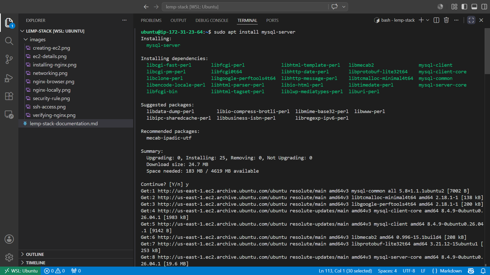

After the installation is complete, we can login to the mysql console using the command;

```
sudo mysql
```

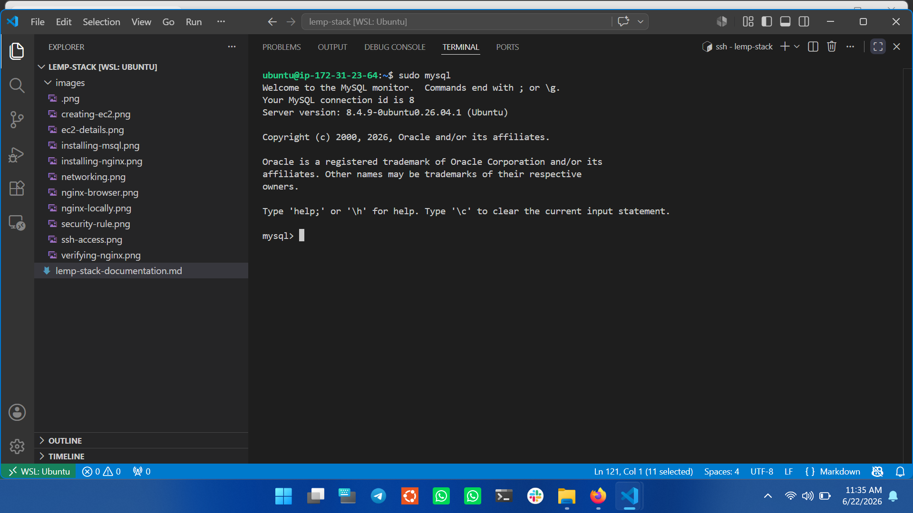

When the installation is finished, it’s recommended that you run a security script that comes pre-installed with MySQL. This script will remove some insecure default settings and lock down access to your database system. But first we need to set root password using mysql_native_password with the command;

```
ALTER USER 'root'@'localhost' IDENTIFIED WITH caching_sha2_password BY 'NEW_PASSWORD';
```

Exit and start the interactive script by running the following command:

```
sudo mysql_secure_installation
```

 and follow the prompts as shown below or custom to your preference. 

 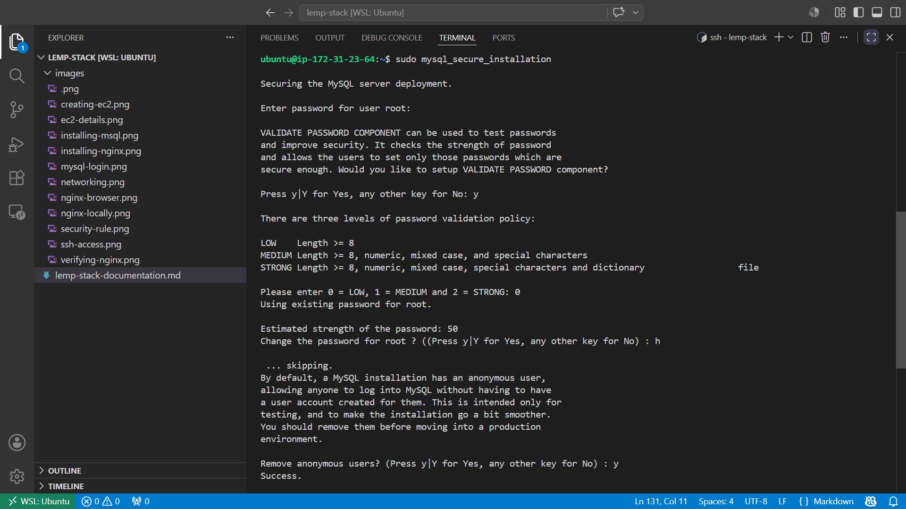

 ##  Step 3: Installing PHP

We now have Nginx installed to serve your content and MySQL installed to store and manage your data. Now you can install PHP to process code and generate dynamic content for the web server. While Apache embeds the PHP interpreter in each request, Nginx requires an external program to handle PHP processing and act as a bridge between the PHP interpreter itself and the web server. This allows for better overall performance in most PHP-based websites, but it requires additional configuration. You’ll need to install php-fpm, which stands for “PHP fastCGI process manager” to tell Nginx to pass PHP requests to this software for processing. Additionally, you’ll need php-mysql, a PHP module that allows PHP to communicate with MySQL-based databases. Core PHP packages will automatically be installed as dependencies. To install the php-fpm and php-mysql packages, run;


```
sudo apt install php-fpm php-mysql -y
```

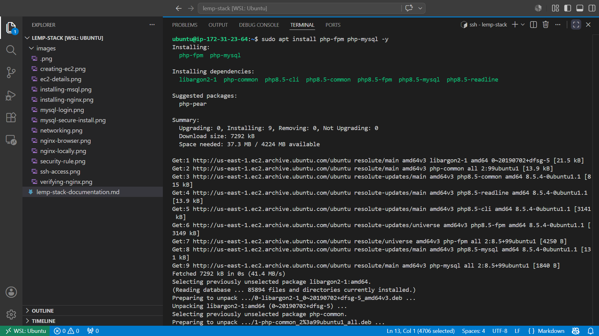


Now that we have php components installed, we need to configure nginx to use them

## STEP 4: Configuring NGINX to use PHP Processor

hile using Nginx webserver, we can create an NGINX server block that will make use of the above FPM pool. To do that, edit your NGINX configuration file and pass the path of pool’s socket file using the option fastcgi_pass inside location block for php.

1\. On Ubuntu 20.04, Nginx has on server block enabled by default in the /var/www/html directory. Instead of using the default directory, we will create our domain near this in /var/www/projectLEMP directory using the command;

```
sudo mkdir /var/www/projectLEMP
```
 
2\. Next we assign the directory to the current users permission with the command;

```
sudo chown -R $USER:$USER /var/www/projectLEMP
```

3\. Then create a new configuration file in nginx "sites-available" directory. Here we'll use the nano editor;

```
sudo nano /etc/nginx/sites-available/projectLEMP 
```

Now paste the following bare-bone configuration: 

```
server {

listen 80;

server_name projectLEMP www.projectLEMP;

root /var/www/projectLEMP;

index index.html index.htm index.php;

location / {

try_files $uri $uri/ =404;

 }

location ~ \.php$ {

 include snippets/fastcgi-php.conf;

 fastcgi_pass unix:/var/run/php/php8.3-fpm.sock;

}

 location ~ /\.ht {

deny all;

}

}
```
 
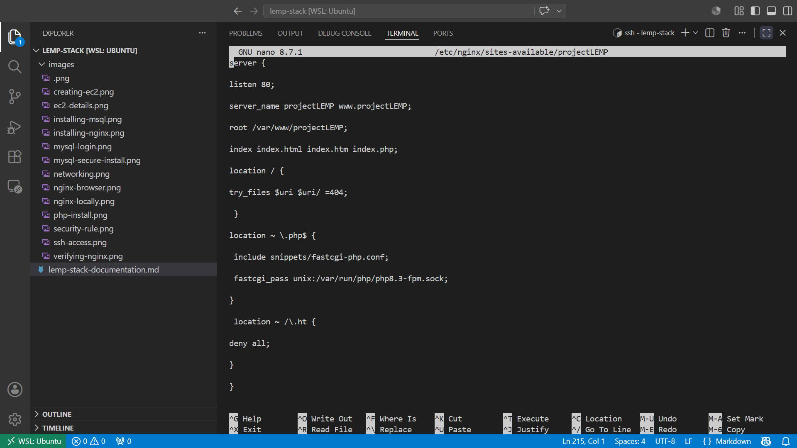


Here’s what each of these directives and location blocks do:

* listen - Defines what port nginx listens on. In this case it will listen on port 80, the default port for HTTP.
* root - Defines the document root where the files served by this website are stored.
* index - Defines in which order Nginx will prioritize the index files for this website. It is a common practice to list index.html files with a higher precedence than index.php files to allow for quickly setting up a maintenance landing page for PHP applications. You can adjust these settings to better suit your application needs.
* server_name - Defines which domain name and/or IP addresses the server block should respond for. Point this directive to your domain name or public IP address.
* location / - The first location block includes the try_files directive, which checks for the existence of files or directories matching a URI request. If Nginx cannot find the appropriate result, it will return a 404 error.
* location ~ .php$ - This location handles the actual PHP processing by pointing Nginx to the fastcgi-php.conf configuration file and the php7.4-fpm.sock file, which declares what socket is associated with php-fpm.
* location ~ /.ht - The last location block deals with .htaccess files, which Nginx does not process. By adding the deny all directive, if any .htaccess files happen to find their way into the document root, they will not be served to visitors.

4\. Activate the configuration by linking to the config file from Nginx’s sites-enabled directory:

 ```
 sudo ln -s /etc/nginx/sites-available/projectLEMP /etc/nginx/sites-enabled/
```

Now test the configuration for syntax errors by typing:
5.
```
sudo nginx -t
```

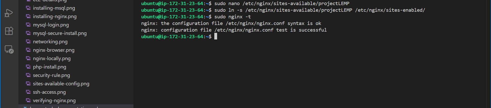


6\. Disable default Nginx host that is currently configured to listen on port 80, for this run:

```
sudo unlink /etc/nginx/sites-enabled/default
```

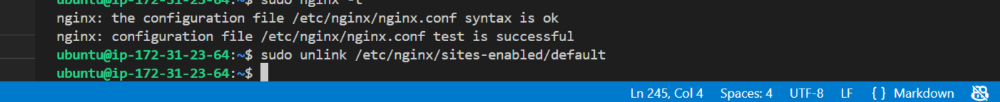

7\. Reload Nginx to apply the changes:

```
sudo systemctl reload nginx
```

The new website is now active, but the web root /var/www/projectLEMP is empty. To test that the new server block works as expected, create an index.html file in this location:

```
sudo echo 'Hello LEMP from hostname' $(TOKEN=`curl -X PUT "http://169.254.169.254/latest/api/token" -H "X-aws-ec2-metadata-token-ttl-seconds: 21600"` && curl -H "X-aws-ec2-metadata-token: $TOKEN" -s http://169.254.169.254/latest/meta-data/public-hostname) 'with public IP' $(TOKEN=`curl -X PUT "http://169.254.169.254/latest/api/token" -H "X-aws-ec2-metadata-token-ttl-seconds: 21600"` && curl -H "X-aws-ec2-metadata-token: $TOKEN" -s http://169.254.169.254/latest/meta-data/public-ipv4) > /var/www/projectLEMP/index.html
```

Now on our browser we can try to open your website URL using IP address:

```
http://<Public-IP-Address>:80
```


This file may be kept in place as a temporary landing page for the application until it is replaced by an index.php file. Once that step is completed, the index.html file must be removed or renamed from the document root, since an index.html file is given precedence over an index.php file by default
The LEMP stack is now fully configured. In the next step, we’ll create a PHP script to test that Nginx is in fact able to handle .php files within your newly configured website.

##  Step 5: Testing PHP with Nginx

At this point, our LAMP stack is completely installed and fully operational. we can test it to validate that Nginx can correctly hand .php files off to your PHP processor. We can do this by creating a test PHP file in your document root. Open a new file called info.php within your document root in your text editor:


```
nano /var/www/projectLEMP/info.php
```

We type the following lines into the new file. This is valid PHP code that will return information about your server:

```
<?php
             phpinfo();
?>
```

You can now access this page in your web browser by visiting the domain name or public IP address you’ve set up in your Nginx configuration file, followed by /info.php:

```
http://`server_domain_or_IP`/info.php
```


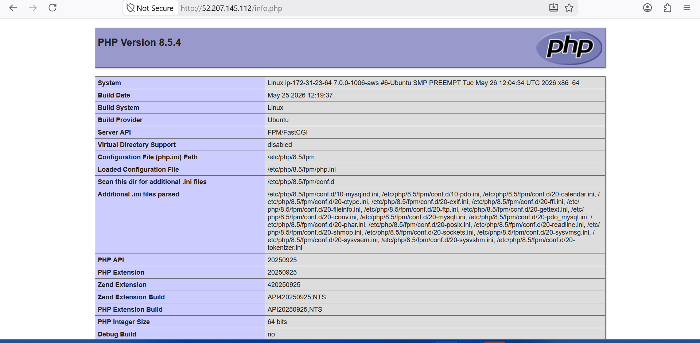


After checking the relevant information about your PHP server through that page, it’s best to remove the file you created as it contains sensitive information about our PHP environment and your Ubuntu server. You can use rm to remove that file:

```
sudo rm /var/www/your_domain/info.php
```

## Step 6 — Retrieving data from MySQL database with PHP

In this step you will create a test database (DB) with simple "To do list" and configure access to it, so the Nginx website would be able to query data from the DB and display it. We’ll need to create a new user with the mysql_native_password authentication method in order to be able to connect to the MySQL database from PHP. We will create a database named example_database and a user named example_user, but you can replace these names with different values. First, connect to the MySQL console using the root account:

```
sudo mysql -p
```

Image

To create a new database, run the following command from your MySQL console:

```
CREATE DATABASE test_database;
```

Now we can create a new user and grant him full privileges on the database we have just created.

The following command creates a new user named example_user, using mysql_native_password as default authentication method. We’re defining this user’s password as PassWord.1, but you should replace this value with a secure password of your own choosing.

```
CREATE USER 'example_user'@'%' IDENTIFIED WITH caching_sha2_password BY 'PassWord.1';
```

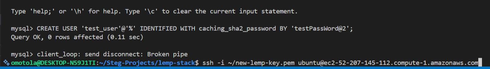


Now we need to give this user permission over the example_database database:

```
GRANT ALL ON test_database.* TO 'example_user'@'%';
```

This will give the example_user user full privileges over the example_database database, while preventing this user from creating or modifying other databases on your server.

Now exit the MySQL shell with:

```
exit;
```

 Image

We can test if the new user has the proper permissions by logging in to the MySQL console again, this time using the custom user credentials:

```
mysql -u example_user -p
```

Notice the -p flag in this command, which will prompt you for the password used when creating the example_user user. After logging in to the MySQL console, confirm that you have access to the example_database database:

```
SHOW DATABASES;
```

Next, we’ll create a test table named todo_list. From the MySQL console, run the following statement: 

```
CREATE TABLE example_database.todo_list (
                                     item_id INT AUTO_INCREMENT,content 
                                     VARCHAR(255), 
                                     PRIMARY KEY(item_id)
                                      );
```

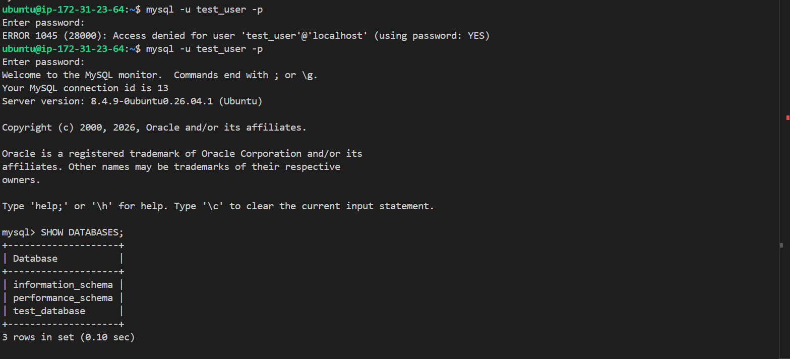
 

Insert a few rows of content in the test table. You might want to repeat the next command a few times, using different VALUES:

```
INSERT INTO example_database.todo_list (content) VALUES ("My first important item");
```

To confirm that the data was successfully saved to your table, run:

```
SELECT * FROM example_database.todo_list;
```

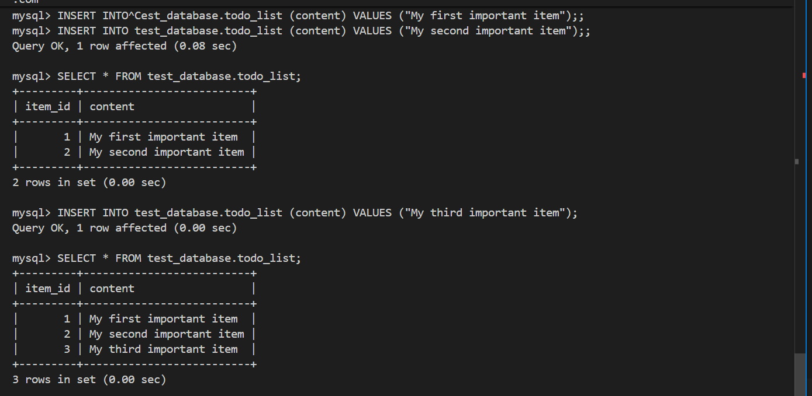

After confirming that you have valid data in your test table, you can exit the MySQL console:

```
exit;
```

Now we can create a PHP script that will connect to MySQL and query for our content.

Create a new PHP file in your custom web root directory using your preferred editor:

```
nano /var/www/projectLEMP/todo_list.php
```

The following PHP script connects to the MySQL database and queries for the content of the todo_list table, displays the results in a list. If there is a problem with the database connection, it will throw an exception.

Copy this content into your todo_list.php script:

```
<?php

$user = "example_user";

$password = "PassWord.1";

$database = "example_database";

$table = "todo_list";

 
try {

 $db = new PDO("mysql:host=localhost;dbname=$database", $user, $password);

 echo "<h2>TODO</h2><ol>";

 foreach($db->query("SELECT content FROM $table") as $row) {

 echo "<li>" . $row['content'] . "</li>";

 }

 echo "</ol>";

 } catch (PDOException $e) {

 print "Error!: " . $e->getMessage() . "<br/>";

 die();

}

Save and close the file when you are done editing.

You can now access this page in your web browser by visiting the domain name or public IP address configured for your website, followed by /todo_list.php:

```
http://<Public_domain_or_IP>/todo_list.php
```

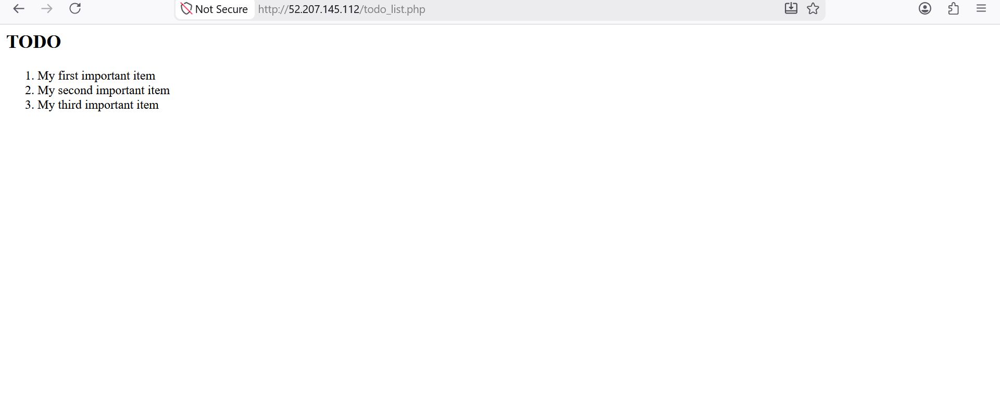
